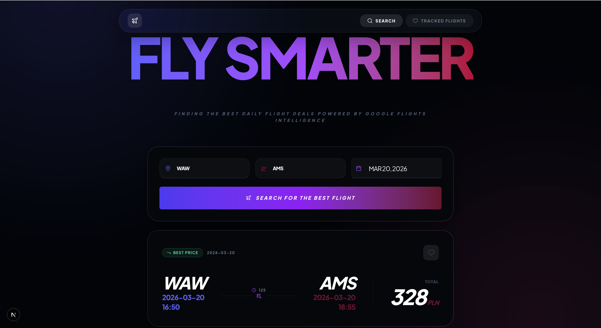
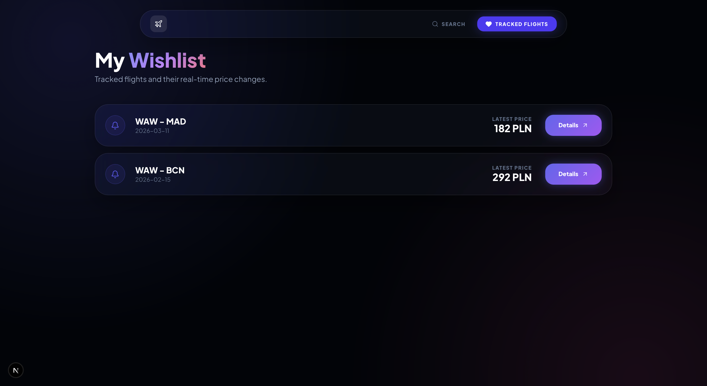
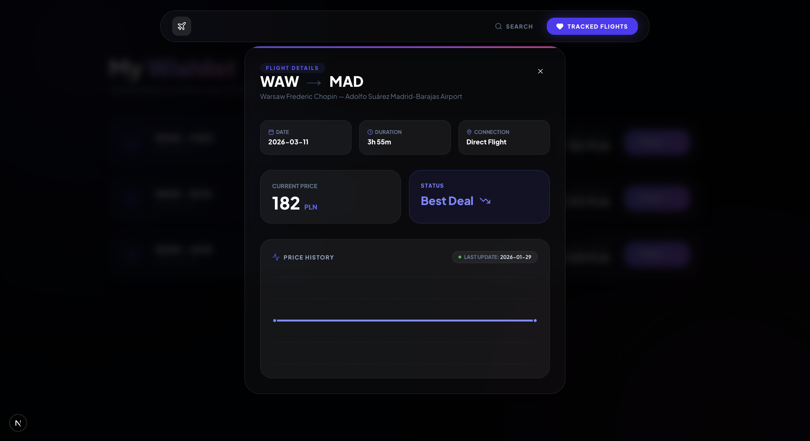

# Flight Tracker Docker

A full-stack flight tracking application built with **FastAPI**, **React**, and **PostgreSQL**. This tool allows users to find the best flight deals using Google Flights data, manage a personal wishlist, and monitor price changes over time.

The entire ecosystem is containerized using **Docker**, featuring an automated data synchronization system managed by the **Ofelia** scheduler.

---

## Screenshots

<p align="center">
  
  
</p>
<p align="center">
  
  
</p>
<p align="center">
  <em>Main Screen & Search Results • Wishlist & Flight Info</em>
</p>

---

## Key Features

* **Smart Flight Search**: Search for **one-way flights** across various destinations.
* **Google Flights Integration**: Leverages SerpAPI to return the **best offers** for any given date directly from Google Flights.
* **Personal Wishlist**: Users can save specific flights to their wishlist for quick access.
* **Price Tracking**: Automatically tracks **price changes** for flights in the wishlist, helping users book at the optimal time.
* **Automated Updates**: Daily background synchronization to ensure flight prices are always up-to-date.
* **RESTful API**: High-performance backend built with FastAPI.
* **Modern UI**: Clean, interactive dashboard built with React.

---

## Tech Stack

| Component | Technology |
| :--- | :--- |
| **Frontend** | React |
| **Backend** | FastAPI (Python) |
| **Database** | PostgreSQL 18 |
| **Scheduler** | Ofelia |
| **Containerization** | Docker / Docker Compose |
| **External API** | SerpAPI (Google Flights) |

---

## Prerequisites

Before you begin, ensure you have the following installed:
* [Docker](https://www.docker.com/) (latest version)
* A **SerpAPI Key** (required to fetch real-time data from Google Flights)

---

## Setup & Installation

1.  **Clone the repository**
    ```bash
    git clone [https://github.com/mariepcc/flight-tracker-docker.git](https://github.com/mariepcc/flight-tracker-docker.git)
    cd flight-tracker-docker
    ```

2.  **Configure Environment Variables**
    Create a `.env` file in the root directory:
    ```env
    # Database Credentials
    DB_USER=postgres
    DB_PASSWORD=your_secure_password
    DB_NAME=flight_db
    DATABASE_URL=postgresql://postgres:your_secure_password@db:5432/flight_db

    # Third-Party API
    SERPAPI_KEY=your_serpapi_key_here
    ```

3.  **Launch the Application**
    ```bash
    docker compose up --build
    ```

---

## Service Access

| Service | URL | Description |
| :--- | :--- | :--- |
| **Frontend** | `http://localhost:3000` | User Interface & Search |
| **Backend** | `http://localhost:8000` | API / Documentation |
| **API Docs** | `http://localhost:8000/docs` | Interactive Swagger UI |
| **Database** | `localhost:5432` | PostgreSQL Entrypoint |

---

## Scheduling

The project utilizes **Ofelia** as a job scheduler to keep flight data fresh without manual intervention.

* **Job**: `update_flights.py`
* **Schedule**: `@daily` (runs once every 24 hours)
* **Function**: This script iterates through the **Wishlist**, re-fetches current prices from Google Flights, and stores the history in the database to enable price tracking.

To check the status of scheduled jobs, run:
```bash
docker logs scheduler
